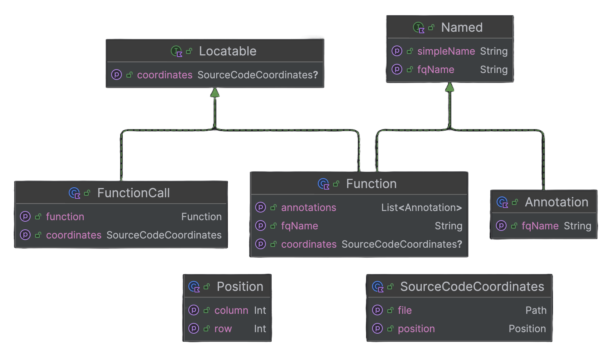

<p align="center">
  
</p>
<br>

**_Injectable_** is a tool that automatically **injects semantic information into Composables** at compilation time,
making your debugging and testing (much) more powerful.

# 💉 Injected information

- fully qualified name,
- annotations,
- composable call site and
- declaration site.

> [!NOTE]  
> The injected information is provided through a custom Compose **semantics property**. Thus, it can be inspected:
> - directly in the Android Studio layout inspector or
> - in an automated UI test.

# 🏋🏼‍♂️ Possible applications

- dynamic UI code analysis,
- information-rich errors in UI tests,
- UI structure analysis and
- hopefully more stuff that I did not think of :sweat_smile:.

# 🛠️ Setup

To use this tool, add the Gradle plugin to your project. The plugins adds the `injectable` dependency and applies
the `injectable-compiler-plugin`.

```kotlin
plugins {
    id("com.vladvamos.injectable") version "<version>"
}
```

To use the (testing) utils from `injectable-testing`, you have to add the dependency manually.

```kotlin
dependencies {
    // or `implementation`, `testImplementation` etc.
    androidTestImplementation("com.vladvamos.injectable:injectable-testing:<version>")
}
```

# 🏭 How does it work?

- For every composable function call, the compiler plugin creates a `FunctionCall` object that contains the semantic
information.
- This object is then injected into the composable’s `Modifier` using the `registerCall(FunctionCall)`
extension function. The extension function call is added to the end of the `Modifier` parameter expression.
- Inside the `Modifier`, the `FunctionCall` is stored in a `CallStack`, which is a type alias for `List<FunctionCall>`.
Nested composables often share the same `Modifier` object, which leads to UI elements that have multiple `FunctionCall`s
assigned to them.
- When the `Modifier` object is evaluated, the `CallStack` is added to the custom `composableCallStack` semantics
property. This exposes the `CallStack` to testing APIs and debugging tools.

Thus, the functionality of this tool totally depends on Compose’s `Modifier` parameters, which are the basis on which
the semantic information is stored, transferred, and later retrieved.

# ⚽ Example usage

This tool can be used for a lot of purposes. Some are more interesting than the others. Here are a few examples.

## Better reporting in UI tests

Some UI tests verify certain properties of UI elements (e.g., text, content description, or position on the screen).
If a UI element does not match the expectations, the test usually logs a message or throws an error. The error log or
message has to correctly describe the problematic element, which is sometimes complicated, because only identifiers such
as the test tag, displayed text or the index in a list are known. _Injectable_ can be used to enhance the error messages
in such cases, as the injected semantic information contains the source code location of each composable call (among
many other bits of semantic information). The extension function `FunctionCall.buildCallSiteLink()` builds a _clickable_
link (in `String` form) to the call site of the composable function call.

```kotlin
class MainPageTitleTest {
    @get:Rule
    val rule = createAndroidComposeRule<MainPageActivity>()

    @Test
    fun verifyMainPageTitle() {
        val pageTitle = rule.onNodeWithTag("pageTitle")
        pageTitle.assertIsDisplayed()
        val pageTitleNode = pageTitle.fetchSemanticsNode()

        // Now we can safely get the text.
        val displayedText =
            pageTitleNode.config.getOrNull(SemanticsProperties.Text)?.joinToString("")
        val expectedText = "The Main Page"

        if (displayedText == null || displayedText != expectedText) {
            val locationAtString = pageTitleNode.callStack?.first()?.buildCallSiteLink()
            error("Wrong text set $locationAtString")
            // e.g.: "Wrong text set at PageTitle.kt:140:12"
        }
    }
}
```

## UI test that verifies test tags

This is a Compose UI test that runs on an emulator. It starts the `MainActivity` and parses the displayed UI nodes to
check for test tags. A composable's need for a test tag is marked by the `@RequireTestTag` annotation. The test
fails if it detects an element that needs a test tag but did not receive one.

```kotlin
class TestTagTest {
    @get:Rule
    val rule = createAndroidComposeRule<MainActivity>()

    @Test
    fun verifyTestTags() {
        // Traverse all displayed nodes that have a CallStack (the injected information).
        rule.onAllNodesWithCallStack { node, callStack ->
            val annotationNames = callStack.annotations.map { it.simpleName }
            
            // @RequiresTestTag is a user-defined annotation that signals that the need
            // for a test tag.
            val requiresTestTag = "RequiresTestTag" in annotationNames
            val hasTestTag = node.config.getOrNull(SemanticsProperties.TestTag) != null
            
            if (requiresTestTag && !hasTestTag) {
                val firstCall = callStack.first()
                val composableName = firstCall.function.simpleName
                val callLocationString = firstCall.buildCallSiteLink()
                
                error("No test tag received for $composableName ($callLocationString)")
                // e.g.: "No test tag received for Text (at Main.kt:44:8)"
            }
        }
    }
}
```

# 🧬 Data structure

The semantic information for one UI element is stored in a `CallStack`, which is a type alias for `List<FunctionCall>`.
Check out the diagram below for information about the underlying structure of `FunctionCall`.



# 👷🏼‍♂️ Project structure

This project is split into four subprojects:
- `injectable` defines the data structure and creates the custom semantics property (and `Modifier` extensions),
- `injectable-gradle-plugin` adds the `injectable` dependency and applies the `injectable-compiler-plugin`,
- `injectable-compiler-plugin` plugs into the Kotlin compilation and injects the Composable calls with
  semantic information,
- `injectable-testing` defines utility functions for reading the injected semantic information and parsing its
  data stucture.

# 📣 Bug reports and feature requests

If you find a bug or would like to make a feature request, simple create a GitHub Issue and I will happily take a look.
Or contribute yourself (I'll offer support anytime).

# 💪🏼 Contributing

As stated above, contributions are welcome! Open a PR and I will check it out :blush:.
